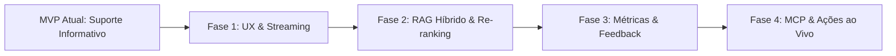

# 🗺️ Roadmap de Evolução — Agente de Suporte RAG

Este documento descreve o estado atual do projeto como um **MVP (Produto Mínimo Viável)** e detalha as fases de evolução.

---

## 📍 Estado Atual: O que faz deste projeto um MVP?

O projeto atingiu com sucesso o estágio de **MVP funcional e resiliente**:

1. **Infraestrutura Pronta para Nuvem:** Deploy conteinerizado com Docker rodando (ex: no Google Cloud Run) com porta dinâmica.
2. **Arquitetura RAG Integrada:** Vetorização e persistência de manuais em **ChromaDB**, leitura via **Firecrawl** e síntese inteligente com **Google Gemini**.
3. **Engenharia de Prompt Especializada:** Reconhecimento de contexto, **desambiguação guiada** para perguntas vagas e instruções estritas contra alucinações.
4. **Resiliência e Tolerância a Falhas:** Retries automáticos com backoff progressivo para picos de falha, auto-recuperação de sessões corrompidas e mensagens amigáveis na interface web (Streamlit).

---

## 🚀 Fases de Evolução Futura



---

### 🌟 Fase 1: Experiência do Usuário (UX) e Agilidade
- [ ] **Streaming de Resposta:** Implementar geração token por token (`st.write_stream`), fazendo a resposta começar a surgir na tela mais rapidamente.
- [ ] **Botões Rápidos de Opções (Chips):** Quando o agente apresentar opções numeradas, disponibilizar botões clicáveis além do campo de digitação.
- [ ] **Widget Web Flutuante:** Criar componente embeddable (balão flutuante) para que o agente possa ser inserido diretamente dentro do portal/aplicativo.

---

### 🧠 Fase 2: Precisão e Atualização Contínua do RAG
- [ ] **Busca Híbrida (BM25 + Vetorial):** Combinar busca por palavras-chave exatas e busca semântica para facilitar a recuperação de termos técnicos.
- [ ] **Re-ranking (Cohere / Cross-Encoder):** Reordenar os chunks recuperados para que os parágrafos mais precisos fiquem sempre no topo do contexto do modelo.
- [ ] **Sincronização Automática da Documentação:** Criar um cron job agendado que monitora alterações nas URLs dos manuais e re-vetoriza o banco sem necessidade de intervenção manual.

---

### 📊 Fase 3: Métricas, Observabilidade e Inteligência de Negócio
- [ ] **Botões de Avaliação (👍 / 👎):** Coleta de satisfação do usuário em cada resposta para identificar pontos de melhoria no suporte.
- [ ] **Gap Analysis (Dúvidas sem Resposta):** Dashboard apontando quais foram as perguntas mais frequentes e onde o manual atual possui lacunas de informação.
- [ ] **Monitoramento de Custos e Latência:** Integração com ferramentas de rastreamento (Langfuse ou Arize Phoenix) para acompanhar custo por token, tempo de resposta e taxa de erros.

---

### ⚡ Fase 4: Do Suporte Informativo para o Suporte Ativo (MCP e APIs)
- [ ] **Consultas em Tempo Real:** Conectar o agente às APIs dos sistemas via **MCP (Model Context Protocol)** ou Tool Calling para consultas reais.
- [ ] **Transbordo Humano Inteligente:** Se o usuário solicitar falar com um atendente humano, abrir chamado automaticamente em plataformas de suporte.

---

## 💻 Como Rodar o Projeto Localmente no Terminal

### 1. Configurar Chaves de API:
Renomeie o arquivo `.env.example` para `.env` e preencha com suas chaves (Google Gemini e Firecrawl).

### 2. Iniciar a Aplicação Web (Streamlit):
Para abrir a interface do chat no navegador:
```powershell
uv run streamlit run app.py
```
*A aplicação abrirá automaticamente no endereço `http://localhost:8501`.*

### 3. Rodar a Bateria de Testes em Batch:
Para executar as perguntas de teste automatizadas diretamente no terminal:
```powershell
uv run python src/agente_suporte/main.py
```

### 4. Sincronizar Dependências do Ambiente:
Caso baixe novas alterações do repositório:
```powershell
uv run uv sync
```
